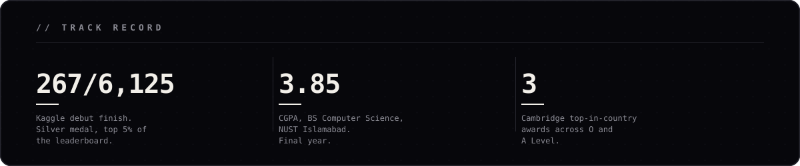

<picture>
  <source media="(prefers-color-scheme: dark)" srcset="./assets/banner-dark.svg">
  <source media="(prefers-color-scheme: light)" srcset="./assets/banner-light.svg">
  
</picture>

  
  
  
  

Final-year CS at NUST, Islamabad. I build agentic systems that keep running after I close the laptop: Text-to-SQL agents business users actually query, RAG stacks that retrieve instead of guess, and ML pipelines that ship on a cron.

<picture>
  <source media="(prefers-color-scheme: dark)" srcset="./assets/stats-dark.svg">
  <source media="(prefers-color-scheme: light)" srcset="./assets/stats-light.svg">
  
</picture>

 

## <samp>01</samp> &nbsp;Selected work

### [nn-architect](https://github.com/HunainAshraf4989/Neural-Network-Playground) &nbsp;`MCP` `PyTorch` `React`

An MCP server with 13 tools an agent uses to design PyTorch models, while you edit the same graph live on a React canvas. Shape errors are caught by executing the model in a sandboxed subprocess, not by reading it.

### AI Hunain &nbsp;`FastAPI` `LangChain` `Gemini` `Qdrant`

The assistant on my site is a RAG pipeline over my own resume and GitHub. Free-tier quota, not correctness, was the binding constraint: a curated FAQ and a cache answer the common questions with zero model calls, and the chain falls through six models when one runs dry.

### [Academic Policy QA](https://github.com/ARFAABDULNASIR/NUST_UGHandbook_RAG-system) &nbsp;`RAG` `MinHash+LSH` `RRF`
with [@ARFAABDULNASIR](https://github.com/ARFAABDULNASIR)

Hybrid retrieval over NUST undergraduate handbooks: MinHash+LSH candidate filtering, IDF-weighted SimHash re-ranking and a TF-IDF baseline, fused with RRF.

### [Roman Urdu Hate-Speech Detection](https://github.com/ARFAABDULNASIR/Roman-Urdu-Hate-speech-Detection) &nbsp;`Transformers` `PyTorch`
with [@ARFAABDULNASIR](https://github.com/ARFAABDULNASIR)

Roman Urdu is spoken by 170M+ people and benchmarked by almost nobody. TF-IDF baselines through to multilingual transformer fusion, against 5+ spelling variants per word and the hate that carries no keyword at all.

### [Crime Vision](https://github.com/abdullah-naeem-gh/Crime_Analysis_backend) &nbsp;`React` `Express` `PostgreSQL` `MongoDB` `Redis`
with [@abdullah-naeem-gh](https://github.com/abdullah-naeem-gh)

Storage split by access pattern: crime data in PostgreSQL, community posts in MongoDB, predictions cached in Redis. A `safePath` algorithm routes people through the lowest-crime corridors, not the shortest ones.

<b>More: FinSight, Smog Penalty, Olympic Data Viz, Secure Bank</b>

 

**FinSight** &nbsp;`Python` `Random Forest` `ANN` &nbsp; OHLCV ingestion from several market APIs, Random Forest ticker filtering, then ANN price prediction, on a cron with no human in the loop.

**[Smog Penalty](https://github.com/GitMithril/Smog-Penalty/)** &nbsp;`Python` `Forecasting` &nbsp; Weather, pollution and irradiance data combined to put a number on the solar output Pakistan loses to smog season.

**[Olympic Data Visualization](https://github.com/HunainAshraf4989/olympic-data-visualization)** &nbsp;`Streamlit` `Pandas` &nbsp; Interactive analytics over a century of Olympic data.

**[Secure Bank](https://github.com/A-Hassan-5/SecureBank)** &nbsp;`Java` `JavaFX` `DSA` &nbsp; with [@A-Hassan-5](https://github.com/A-Hassan-5) and [@uswa12](https://github.com/uswa12). No external database permitted, so the whole banking system runs on nested HashMaps and CSV files.

 

## <samp>02</samp> &nbsp;Where I've shipped

**Tensor Labs** &nbsp;·&nbsp; ML Engineer Intern &nbsp;·&nbsp; Jun to Jul 2026 
Qualzo's admin and monitoring stack, provisioned as code and shipped with the FastAPI backend. Funnel analytics off Postgres materialised views, and LLM cost tracking attributed by model, provider and operation.

**Tensor Labs** &nbsp;·&nbsp; ML Engineer Intern &nbsp;·&nbsp; Jul to Sep 2025 
A Text-to-SQL agent that generates, validates and formats SQL from plain English. FinSight's trading-signal pipeline, and Hyper-NBA score prediction delivered to a client.

 

## <samp>03</samp> &nbsp;Stack

|  |  |
|---|---|
| **Agentic / LLM** | LangChain · LangGraph · MCP · RAG · evals · prompt engineering |
| **ML / DL** | PyTorch · Transformers · scikit-learn · XGBoost · Random Forest · ANN |
| **Backend** | Python · FastAPI · PostgreSQL · MongoDB · Redis · Qdrant · Docker |
| **Frontend** | TypeScript · React · Next.js · Tailwind |

 

## <samp>04</samp> &nbsp;Now

Building **VoiceStudio**, my final-year project at SEECS: a bilingual Urdu and English voice tutor for vocational auto-electrician training. Most of the people it is for do not read the language the training material is written in.

<b>Education and certifications</b>

 

**BS Computer Science, NUST** · 2023 to 2027 · CGPA 3.85 
**A Levels, Sadiq Public School** · 4 A*s · Top in Punjab 2022 · Top in Punjab and 3rd in Pakistan 2023 
**O Levels, Sadiq Public School** · 6 A*s · Top in Pakistan, Biology

**Kaggle**: 267th of 6,125 teams in ROGII Wellbore Geology Prediction, a silver medal in a debut competition.

**deeplearning.ai / Stanford**, all verified:
[Machine Learning Specialization](https://coursera.org/share/724736adfbc001c2db32736066e34c36) ·
[Supervised ML: Regression & Classification](https://coursera.org/share/c4ccc4b710152fa9a1c2b4df3e15e279) ·
[Advanced Learning Algorithms](https://coursera.org/share/614ddee3ecfa8a1b07fa0b0d36c81883) ·
[Unsupervised Learning, Recommenders & RL](https://coursera.org/share/bdb45808eeee6ba6417af57198256d48) ·
[Neural Networks and Deep Learning](https://coursera.org/share/46956ebcee895d78da55e675578297cf) ·
[Improving Deep Neural Networks](https://coursera.org/share/a54671c6e55a72a758dbc5e19f3f2fef) ·
[Structuring Machine Learning Projects](https://coursera.org/share/e72d40b83d5371a1c754994ecca57566)

 

<picture>
  <source media="(prefers-color-scheme: dark)" srcset="https://raw.githubusercontent.com/HunainAshraf4989/HunainAshraf4989/output/snake-dark.svg">
  <source media="(prefers-color-scheme: light)" srcset="https://raw.githubusercontent.com/HunainAshraf4989/HunainAshraf4989/output/snake-light.svg">
  
</picture>

---

  The assistant on <a href="https://muhammadhunainashraf.tech">my site</a> answers questions about all of this from a RAG pipeline over this exact profile. Don't take my word for it. Ask my AI.

